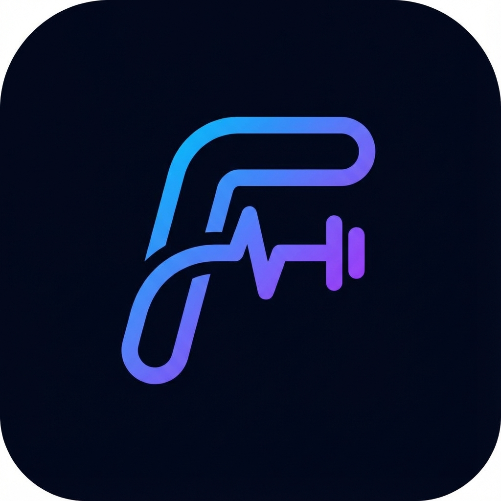

# MyFitt

**Tu Entrenador Personal, Nutricionista y Coach de Vida en tu Bolsillo.**

MyFitt no es solo otra aplicación de fitness; es un ecosistema completo diseñado para transformar tu salud y bienestar físico. Utilizando la última tecnología en Inteligencia Artificial, MyFitt crea una experiencia totalmente personalizada que se adapta a ti, a tus objetivos y a tu estilo de vida.



## 🚀 ¿Por qué elegir MyFitt?

En un mundo lleno de aplicaciones genéricas, MyFitt destaca por ofrecer una experiencia **Premium**, intuitiva y profundamente personalizada. Olvídate de las hojas de cálculo aburridas y los planes estáticos.

### ✨ Características Principales

#### 🤖 AI Personal Trainer (Tu Entrenador Inteligente)

- **Rutinas Generadas por IA:** Dile adiós a la parálisis por análisis. Nuestra IA diseña rutinas de entrenamiento específicas para ti, basadas en tu nivel, equipo disponible y objetivos.
- **Adaptabilidad Total:** ¿Solo tienes 20 minutos? ¿Te duele la rodilla? La IA ajusta tu entrenamiento al instante.
- **Progresión Inteligente:** El sistema aprende de tu rendimiento y ajusta la dificultad para garantizar que siempre estés progresando sin estancarte.

#### 🥗 Smart Nutrition (Nutrición sin Complicaciones)

- **Escaneo de Comidas con IA:** Simplemente toma una foto de tu plato y deja que nuestra IA identifique los alimentos y calcule los macros por ti. ¡Magia!
- **Seguimiento de Macros y Calorías:** Visualiza fácilmente tu ingesta diaria de proteínas, carbohidratos y grasas para mantenerte en el camino correcto.
- **Planes de Comidas:** Recibe sugerencias de comidas que se ajustan a tus necesidades calóricas.

#### 📈 Progress Analytics (Visualiza tu Éxito)

- **Estadísticas Detalladas:** Gráficos hermosos e interactivos que te muestran tu evolución en fuerza, peso corporal, consistencia y más.
- **Gamificación:** Sube de nivel, desbloquea logros y mantente motivado viendo cómo tus estadísticas mejoran día a día.
- **Historial Completo:** Guarda un registro de cada levantamiento, cada comida y cada hito alcanzado.

#### 👟 Gestión de Equipo (Shoe Tracker)

- **Control de Kilometraje:** Registra tus zapatillas de correr y lleva un control preciso de su vida útil para evitar lesiones.

#### 👥 Comunidad y Social

- **Comparte tus Logros:** Genera imágenes atractivas con el resumen de tu entrenamiento para compartir en Instagram o con tus amigos.

#### 💎 Experiencia Premium (Pro)

- Suscripción opcional para usuarios exigentes.
- Generaciones de IA ilimitadas.
- Análisis de datos avanzado y tendencias a largo plazo.

---

## 🛠️ Información Técnica para Desarrolladores

Si eres desarrollador y quieres contribuir o desplegar tu propia instancia de MyFitt, aquí tienes los detalles técnicos.

### Tech Stack

#### Frontend

- **Core:** React 19, TypeScript, Vite
- **Estilos:** Tailwind CSS v4, PostCSS, Diseño Responsivo Mobile-First
- **Estado & Routing:** React Context, React Router v7
- **UX/UI:** Lucide React (Íconos), @dnd-kit (Drag & Drop), Framer Motion (Animaciones)
- **PWA:** Totalmente instalable y offline-capable con `vite-plugin-pwa`

#### Backend & Servicios

- **Plataforma:** Firebase (Google Cloud)
  - **Auth:** Gestión de usuarios segura.
  - **Firestore:** Base de datos NoSQL en tiempo real.
  - **Functions:** Serverless computing para la lógica de negocio y la IA.
  - **Storage:** Almacenamiento de imágenes de usuarios y comidas.
- **Inteligencia Artificial:** Integración con modelos LLM (Gemini/OpenAI) a través de Firebase Functions.
- **Pagos:** Integración completa con Stripe para suscripciones.

### Configuración del Proyecto

1.  **Clonar el repositorio:**

    ```bash
    git clone <url-del-repo>
    cd MyFitt
    ```

2.  **Versión de Node.js recomendada:**

    ```bash
    node -v  # debe ser v22.x
    ```

2.  **Instalar dependencias:**

    ```bash
    pnpm install
    ```

    _Para el backend (Functions):_

    ```bash
    cd functions && pnpm install && cd ..
    ```

3.  **Variables de Entorno:**
    Crea un archivo `.env` en la raíz con tus credenciales de Firebase:

    ```bash
    VITE_FIREBASE_API_KEY=...
    VITE_FIREBASE_AUTH_DOMAIN=...
    VITE_FIREBASE_PROJECT_ID=...
    # ... otras variables de Firebase
    ```

    Crea un archivo `.env` en `functions/` para el backend:

    ```bash
    STRIPE_SECRET_KEY=...
    GEMINI_API_KEY=...
    # ... otras variables de servidor
    ```

4.  **Ejecutar en desarrollo:**

    ```bash
    pnpm dev
    ```

5.  **Build de producción:**
    ```bash
    pnpm build
    ```
